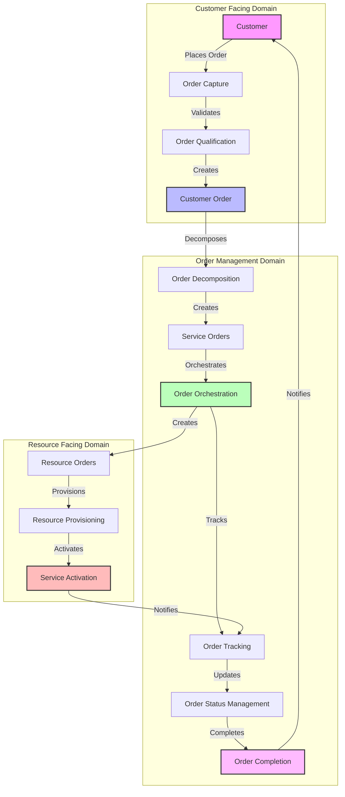
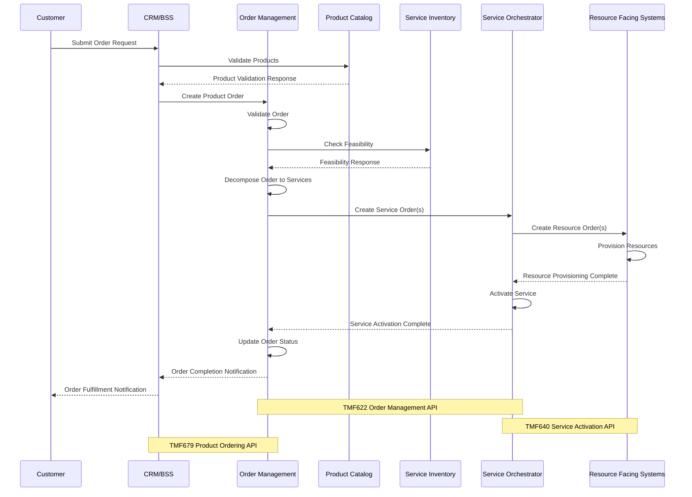

# Order Management in the TMForum Framework

## Order Management Overview

Order Management in TMForum is a critical business function that handles the complete lifecycle of customer orders from capture to fulfillment. It acts as the orchestration layer between customer-facing systems and resource-facing systems, ensuring that service requests are properly translated into actionable tasks for network and IT resources.

The TMForum Order Management follows these key principles:

1. **Order Capture**: Receives and validates customer orders from various channels
2. **Order Decomposition**: Breaks down complex orders into manageable components
3. **Feasibility Check**: Validates if requested services can be delivered
4. **Order Orchestration**: Coordinates fulfillment activities across systems
5. **Order Tracking**: Monitors order progress and provides status visibility
6. **Completion and Notification**: Finalizes order and notifies stakeholders

The TMForum's Open Digital Architecture (ODA) and Business Process Framework (eTOM) provide standardized models for implementing Order Management systems that can interoperate across the ecosystem.

## TMForum Order Management Flow

## TMForum Order Management APIs

The TMForum provides standardized APIs (TMF622 - Order Management API) that enable consistent implementation and integration. These APIs define:

* Product Order resource models
* Service Order resource models
* Resource Order resource models
* Notification patterns
* State machines for order lifecycle management

## Order Processing Sequence

Let me also create a sequence diagram to show the interactions between different components during order processing:

## Key Components of TMForum Order Management

1. **Product Order Management**:
   * Handles commercial aspects of customer orders
   * Manages product bundles, pricing, discounts, and billing arrangements
   * Interfaces with CRM and BSS systems

2. **Service Order Management**:
   * Translates product orders into service specifications
   * Coordinates service provisioning and activation
   * Handles technical implementation details

3. **Resource Order Management**:
   * Allocates network and IT resources
   * Manages resource reservation and assignment
   * Interfaces with network management systems

4. **Catalog-Driven Architecture**:
   * Product, service, and resource catalogs drive the order management process
   * Provides configuration rules and decomposition logic
   * Enables dynamic product offerings and bundling

5. **Order Lifecycle Management**:
   * Implements state machines for tracking order progress
   * Provides status visibility to stakeholders
   * Handles exceptions, fallbacks, and compensations

6. **Integration Capabilities**:
   * Exposes standardized APIs for ecosystem integration
   * Supports event-driven notifications
   * Enables closed-loop automation

TMForum's approach to Order Management emphasizes standardization, modularity, and interoperability, allowing service providers to implement flexible and efficient order processing systems that can adapt to changing business requirements and technological landscapes.